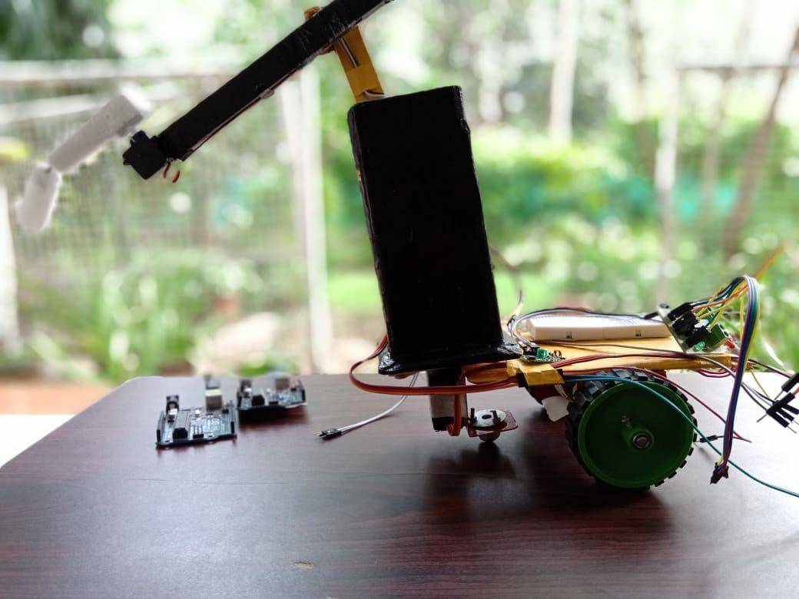

# Project-ARM

This a project built for a science expo. It is  3 dergee freedom moblie armed robot it was built in collab with @athravsam and @yashk
.It is built on a ardunio and is the UI uses tkinter

## Functionalitieis
<ul>
  <li>Remote Control</li>
  <li>Mobile</li>
  <li>3 degree freedom</li>
</ul>

